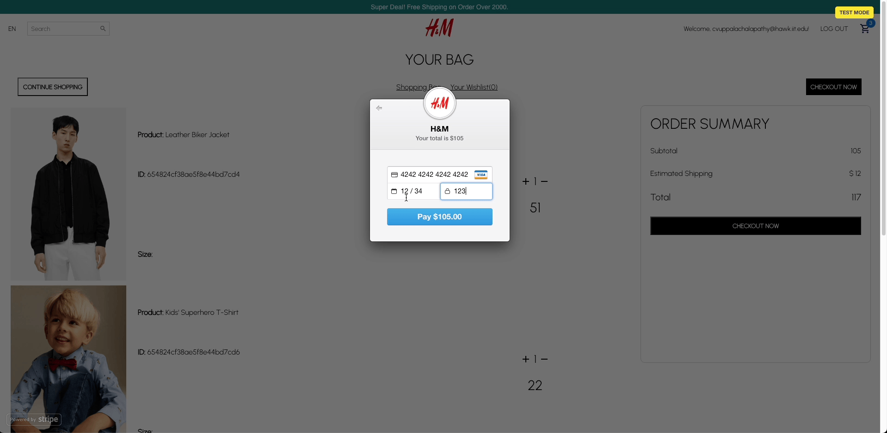

# 🛍️ Versatile E-Commerce Platform

Welcome to our advanced e-commerce platform—a comprehensive full-stack solution developed using MongoDB, Express.js, React, and Node.js. This platform is designed to offer a modern and efficient shopping experience for a variety of retail stores.

## 📜 Overview

This project is an exemplary model of an e-commerce store, equipped to handle various retail needs. It allows users to filter products by category, view detailed product information, add items to their cart, adjust quantities, and securely checkout. The Stripe API is integrated for smooth payment processing. A robust back-end, built on MongoDB, ensures all transactions and orders are systematically managed.

## 🛠 Tech Stack

### Frontend

- **React**: For building a dynamic and interactive UI.
- **CSS Modules/Sass**: For styling components in a modular and maintainable way.
- **Redux**: For managing application state.

### Backend

- **Node.js/Express.js**: For the server-side logic.
- **MongoDB**: For the database to store products, users, and orders.
- **JWT**: For authentication and authorization.

## 🎞 Application Demo



## 🗂 Folder Structure

```plaintext
/backend
  /models
  /routes
  .env
  index.js
  package-lock.json
  package.json
/front-end
  /node_modules
  /public
  /src
    /components
    /pages
    /redux
    index.js
  package-lock.json
  package.json
```

## 🔐 Authentication & Authorization

JWT is used for robust, token-based authentication and authorization, ensuring a secure user experience.

## 📈 Admin Dashboard (Upcoming Feature)

Development is underway for an admin dashboard to oversee order placements, user management, and product inventory.

## 🎨 UI/UX Highlights

- Interactive & User-Friendly: The interface is designed to be engaging and intuitive.
- Brand Identity: A color palette and design that embody the brand's style and ethos.
- React Confetti: Adds an engaging visual celebration upon successful order placement.

## 🚀 Running the Service Locally

**Prerequisites**

- [Node.js (v14.15.1)](https://nodejs.org/download/release/v14.15.1/)

**Setup**

1. Clone the repository.
2. Navigate to the front-end directory:

```sh
cd front-end
npm install
npm run start
```

In a new terminal, navigate to the back-end directory:

```sh
cd back-end
npm install
node index.js
```

The application should now be up and running locally. 🎊

## 🏁 Conclusion

This README reflects our dedication to building a top-tier e-commerce solution. It serves as a comprehensive guide for developers and users, and will be updated to mirror the ongoing enhancements of the platform.

## Kudos and Acknowledgements 🌟

A special thank you to:

- Node and Express, for their excellent server-side capabilities.
- React, for enabling a dynamic and engaging user interface.

---

Crafted with ❤️ by Kishore
